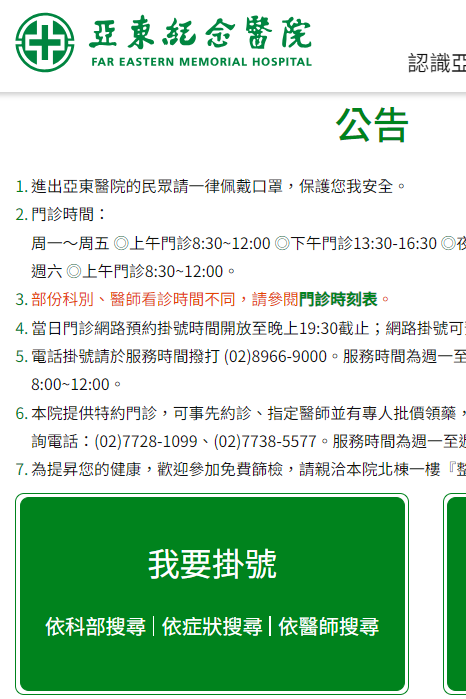
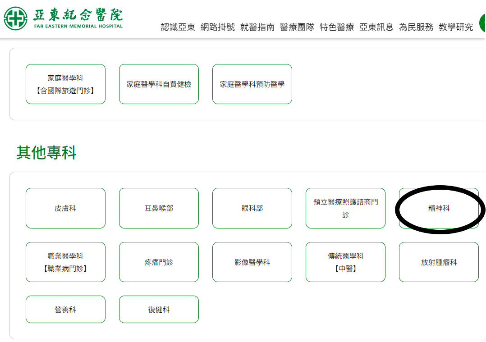
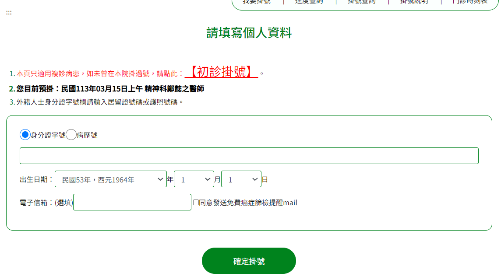
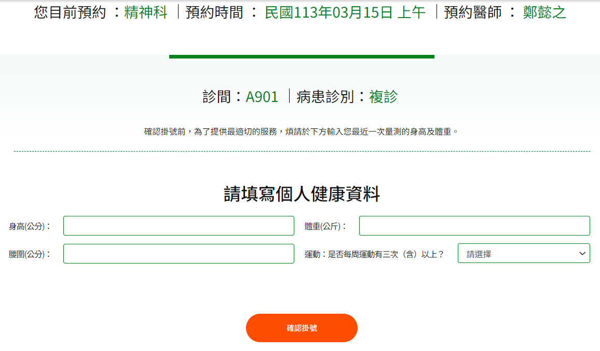

# 第1次作業-作業-HW1
>
>學號：111111102
> 
>姓名：張紘榤
> 
>作業撰寫時間：40 (mins，包含程式撰寫時間)
> 
>最後撰寫文件日期：2024/03/10
>

本份文件包含以下主題：(至少需下面兩項，若是有多者可以自行新增)
- [x] 說明內容
- [x] 個人認為完成作業須具備觀念

## 說明程式與內容
第一題：  
1.fork作業到自己的github  
2.git clone  
3.開啟資料夾 新增A.txt文件  
4.輸入文字This is an apple.  
5.git add並git commit後git push上傳  
6.打開A.txt於This is an apple.後插入Enter  
7.輸入五列文字This is a bear.  
8.重複第5.6步驟  
9.輸入五列文字This is a cake.  
10.git add並git commit後git push上傳 
11.將第1步中的「This is an apple.」回復到同樣位置  
可以利用git checkout
第二題：  
1.開啟亞東醫院網路掛號系統並選擇科別。  

2.選擇科別進行預約  

3.選擇好日期與醫生進行掛號  

4.填寫個人資料  

5.填寫個人健康資料  

6.預約成功於指定日期看診  

## 個人認為完成作業須具備觀念
作業一雖然上學期有做過類似題目，但還是需要不斷練習以免忘記git指令步驟  
這次的作業利用到了分支指令來返回到上一個步
作業二認識到亞東醫院網路掛號的每一個步驟。
